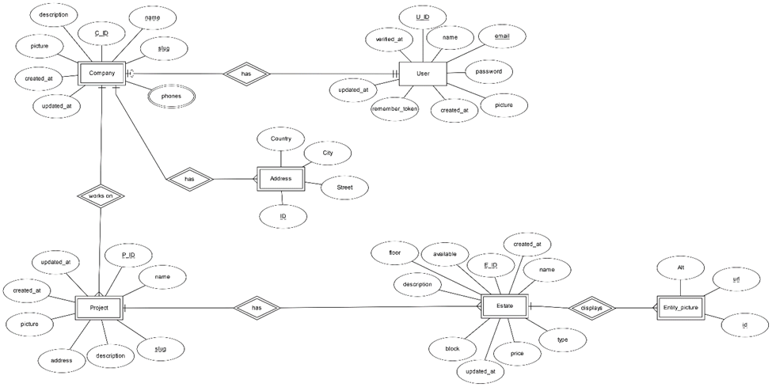
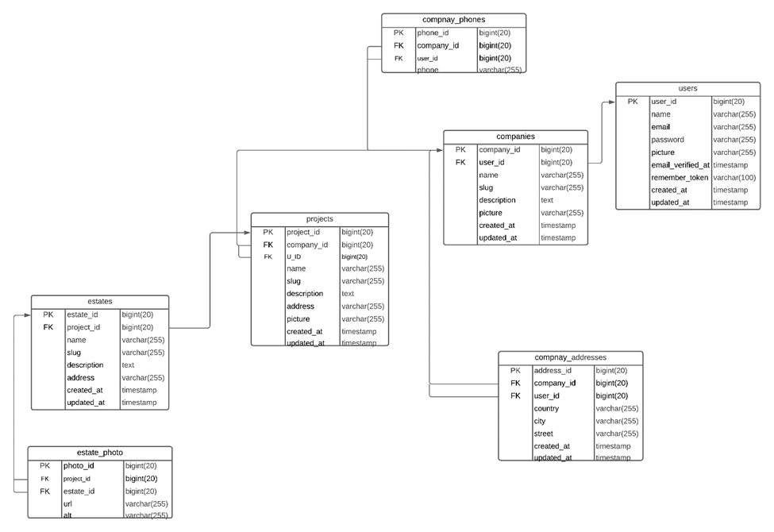
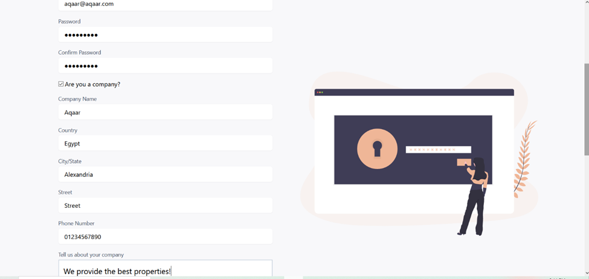
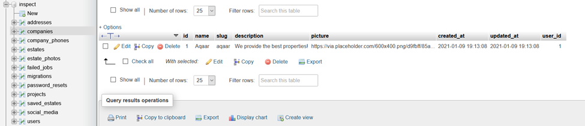

 Inspect | CC414 

_____

### designed and developed By:
#### - Alshaimaa Hossam Mohamed - 17101571
#### - Khaled Ahmed Tag – 16102031

_____

## Problem Definition:
#### This project aims to facilitate connection between real-estate companies and their clients. It provides a user-friendly web platform for the companies to display their residential or commercial properties. Also, real-estate clients can smoothly browse through the available properties from various companies and get a detailed view of each one of them. 

## Business Rules
-	Each User is identified by an ID, name, Email, Password, a picture,  addresses, timestamps (created/updated), user remember token.

-	Companies are owned by users, each user can own only ONE company, and a company can be owned by ONE user. It isn’t mandatory that a user owns a company.

-	Companies are identified by an ID, name, a picture, timestamps (created/updated), unique slug, phone, address(es), description, picture, phone number(s).

-	Companies can have multiple addresses mapping to multiple branches, each address contains Country, City and street.

-	Each company works on multiple projects. A project is identified by an ID, picture, address, description, timestamps, name, and a unique slug.

-	Each project contains multiple estate properties. An estate is identified by an ID, picture(s), name, type, price, description, block, floor, and timestamps.

-	A company cannot exist without a user, a project surely cannot happen without a company working on it and an estate depends on the project that includes it.

## ER Diagram:

_____

## Relational Mapping:

_____

## Registering as company:

### After registration, data is added to the tables successfully. (Comapanies, Phones, Addresses)

 
 
 

### There are many more features,feel free to download the project and explore them.

 
 
 
